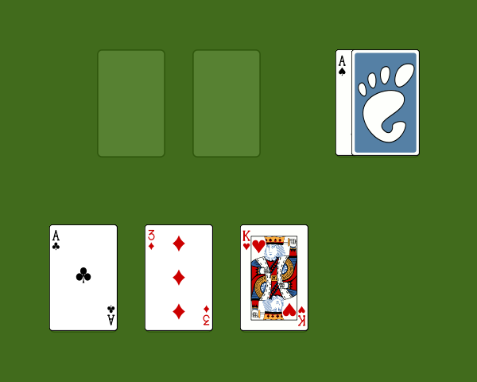
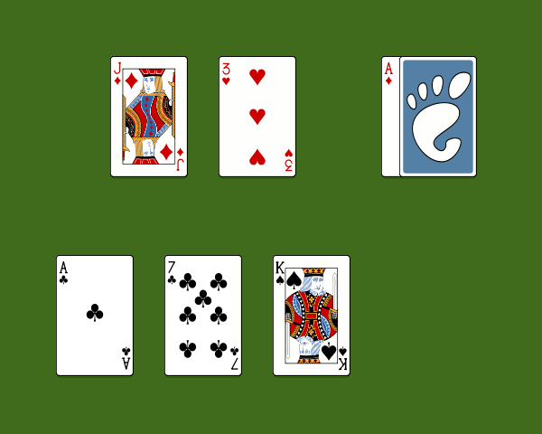

# eBriscola

A Python/pygame implementation of Briscola, a classic Italian card game. Play against a computer opponent using a traditional 40-card Italian deck.

## Screenshots

| Start of game | Mid-game | End of game |
|:---:|:---:|:---:|
|  |  |  |

## How to play

**Objective:** Collect cards worth the most points. The maximum score is 120; win by scoring more than 60.

**Setup:** 40 cards are dealt, 3 to each player. The bottom card of the remaining deck is flipped face-up to determine the *briscola* (trump suit) for the round.

**Each turn:**
1. Click and drag a card from your hand (bottom row) onto the table, or just click it to play it
2. The computer plays its card
3. The highest card of the leading suit wins, unless a briscola (trump) card beats it
4. The winner draws from the deck first; play continues until all cards are exhausted

**Card values:**

| Card | Points |
|------|--------|
| Asso (Ace) | 11 |
| 3 | 10 |
| Re (King) | 4 |
| Regina (Queen) | 3 |
| Fante (Jack) | 2 |
| 7, 6, 5, 4, 2 | 0 |

**Card ranking** (highest to lowest): Asso, 3, Re, Regina, Fante, 7, 6, 5, 4, 2

## Requirements

- Python 3.8+
- [uv](https://github.com/astral-sh/uv) (or pip)

## Running

```bash
uv run python main.py
```

Or with pip:

```bash
pip install pygame
python main.py
```
